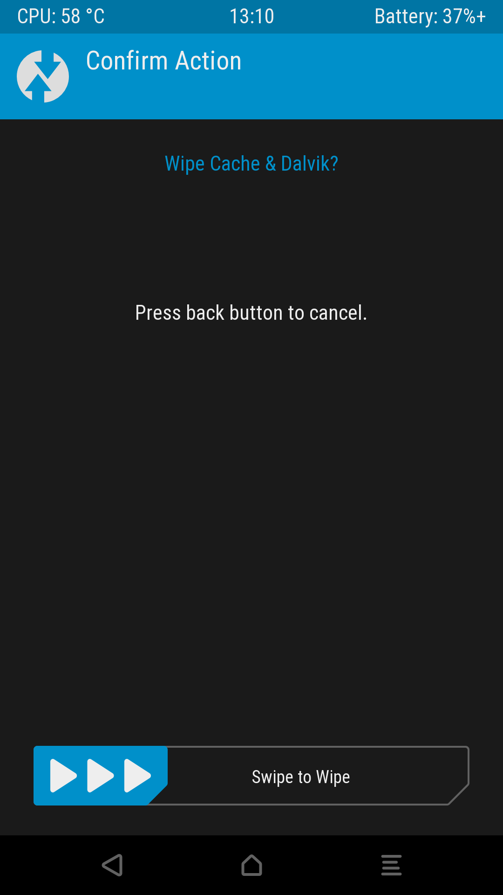

# UpdateOnePlusOneLineageOs

The following guide contains the steps on how to update a OnePlus One device to the latest LineageOS version provided at the moment:

- TWRP is installed
- LineageOS is installed

## 1. Downloading the latest ROM zip file and Google app zip file

1. Go to the [official LineageOS download page](https://download.lineageos.org/bacon) and download the `lineage-XX.X-YYYYYYYY-nightly-bacon-signed.zip` file to your internal storage
   - At the moment this is `lineage-18.1-20210429-nightly-bacon-signed.zip`
2. Check the [official LineageOS Google Apps help page](https://wiki.lineageos.org/gapps.html) to find from which source and which version of the Google apps zip file you should get (it should always be the `arm` [32bit] version)
   - At the moment this is [*MindTheGapps* version 11 `arm`](https://androidfilehost.com/?w=files&flid=322935) (`MindTheGapps-11.0.0-arm-20210412_124103.zip`)

## 2. Backup the old operating system

Backing up the current LineageOS install is strongly recommended to get back to it if someday an update or the new LineageOS version somehow breaks the operating system.
In that case you can just restore app data and the operating system from this backup.

1. Select `Backup`
2. Check the following boxes:
   - `Boot`
   - `System`
   - `Data` (excluding the *storage* - this means that the internal storage where your pictures, music and downloads are located is not backed up, only the LineageOS system and the app data of installed apps)
3. Swipe `Swipe to Backup`

| 1. | 2. and 3. |
| --- | --- |
| | |

## 3. Removing the old operating system

The following steps will remove the old operating system so be careful and sure that you have a backup of your current working operating system!

1. Select `Wipe`
2. Select `Advanced Wipe`
3. Check the following boxes:
   - `Dalvik / ART Cache`
   - `System`
   - `Cache`
4. Swipe `Swipe to Wipe`

| 1. | 2. | 3. and 4. |
| --- | --- | --- |
| | | |

## 4. Install the new operating system (the new version of LineageOS)

1. Select `Install`
2. Select the previously downloaded LineageOS zip file `lineage-XX.X-YYYYYYYY-nightly-bacon-signed.zip`
3. Swipe `Swipe to confirm Flash`
4. Go back and select the previously downloaded Google apps zip file `Gapps-XX.X-arm-YYYYYYYY.zip`
5. Swipe `Swipe to confirm Flash`
6. Click `Wipe Davlik/Cache`
7. Swipe `Swipe to Wipe`
8. Click `Reboot System`

| 1. | 2. | 3. (Part 1) | 3. (Part 2) |
| --- | --- | --- | --- |
| | | | |

| 4. | 5. (Part 1) | 5. (Part 2) and 6. | 7. |
| --- | --- | --- | --- |
| | |  | |

## Bonus: TWRP restore backup

1. Select `Restore`
2. Select one of the previously created backups
3. Check the following boxes:
   - `Boot`
   - `System`
   - `Data`
4. Swipe `Swipe to Restore`

| 1. | 2. and 3. | 4. |
| --- | --- | --- |
| | ||

## Bonus: TWRP recovery

### Install TWRP recovery

Source: [*TWRP for OnePlus One*](https://twrp.me/oneplus/oneplusone.html)

**Linux:**

1. Download the latest TWRP recover image from the [official TWRP page](https://twrp.me/oneplus/oneplusone.html)
   - Go to the section `Download Links` and select the one nearest to your location
   - Select the latest `img` file
     - At the moment this is `twrp-3.5.2_9-0-bacon.img`
2. Install [`android-tools`](https://archlinux.org/packages/community/x86_64/android-tools/) (`pacman -S android-tools`)
3. Enable ADB on your device
   - Either while being in the LineageOS recovery via `Advanced Options`
   - Or in TWRP recovery
   - Or on your device by
     1. Opening `Settings`
     2. Clicking the entry `About`
     3. Finding the `Build Number` entry
     4. Tap on it 7 times to enable `Developer Options`
     5. Go back into the `Settings` list and click the entry `Developer Options`
     6. Finding the `USB Debugging` entry and enable it
4. Run the following commands on your device:

   ```sh
   adb reboot bootloader
   # Wait until a bootloader/fastboot screen is displayed on the device screen
   fastboot flash recovery /path/to/Downloads/twrp-3.5.2_9-0-bacon.img
   ```

5. Now press `power off` and `volume down` (just like you would to boot your phone into recovery) while entering the command:

   ```sh
   fastboot reboot
   ```

6. The device should now boot into TWRP recovery and thus overwrite the previous recovery image (like for example LineageOS recovery)

**TODO:**

Currently this is not working any more, after each boot the TWRP recovery is replaced by LineageOS recovery.
This means this step needs to be done each time a backup or new flash is wanted.

### Update TWRP recovery

Source: [*How To Update TWRP Recovery With TWRP Recovery!* by *KTNTECH*](https://www.youtube.com/watch?v=WAXyPXRkCb0)

1. Download the latest TWRP recover image from the [official TWRP page](https://twrp.me/oneplus/oneplusone.html)
   - Go to the section `Download Links` and select the one nearest to your location
   - Select the latest `img` file
     - At the moment this is `twrp-3.5.2_9-0-bacon.img`
2. Boot your phone into recovery (press `power off` and `volume down`)
3. Click `install`
4. Click `Install Image` to be able to select and image (`.img`) to flash
5. Select the previously downloaded file `twrp-3.5.2_9-0-bacon.img`
6. Select `recovery` as partition to flash
7. Power off the device and restart into recovery (press `power off` and `volume down`) to see if TWRP was updated

| 3. | 4. | 5. | 6. |
| --- | --- | --- | --- |
| | | | |

**TODO:**

Currently this is not working any more, after somehow the installation of LineageOS 18.1 overwrote the recovery which replaces TWRP each time the device boots into LineageOS.
For further information read the previous section *Install TWRP recovery*.
